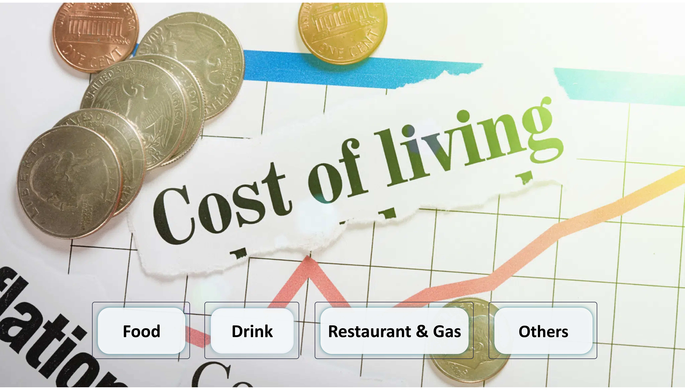
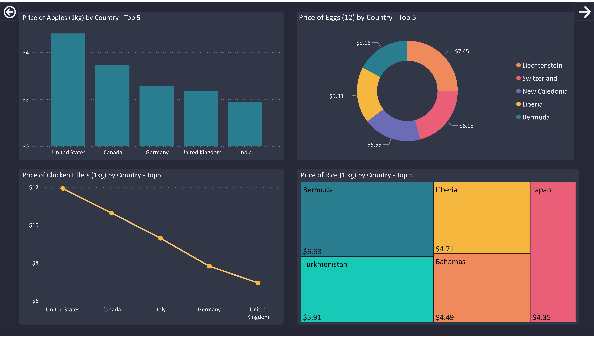
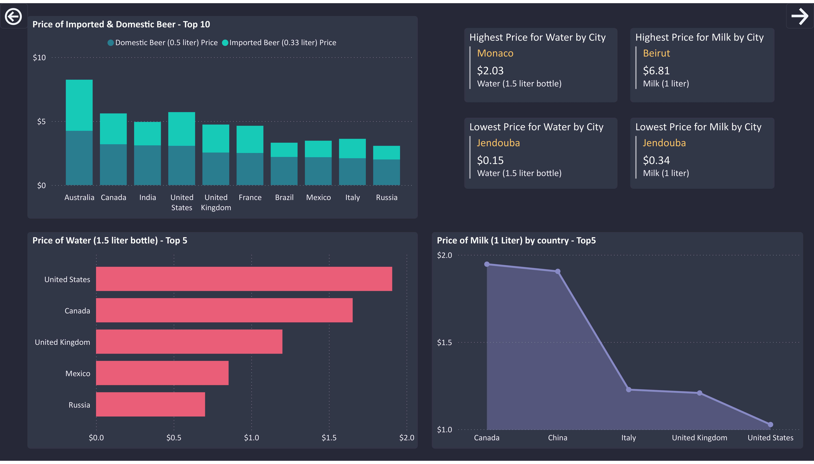
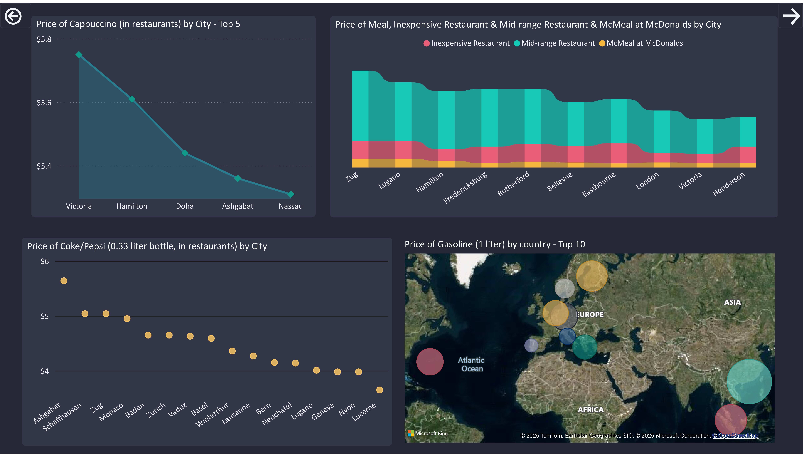
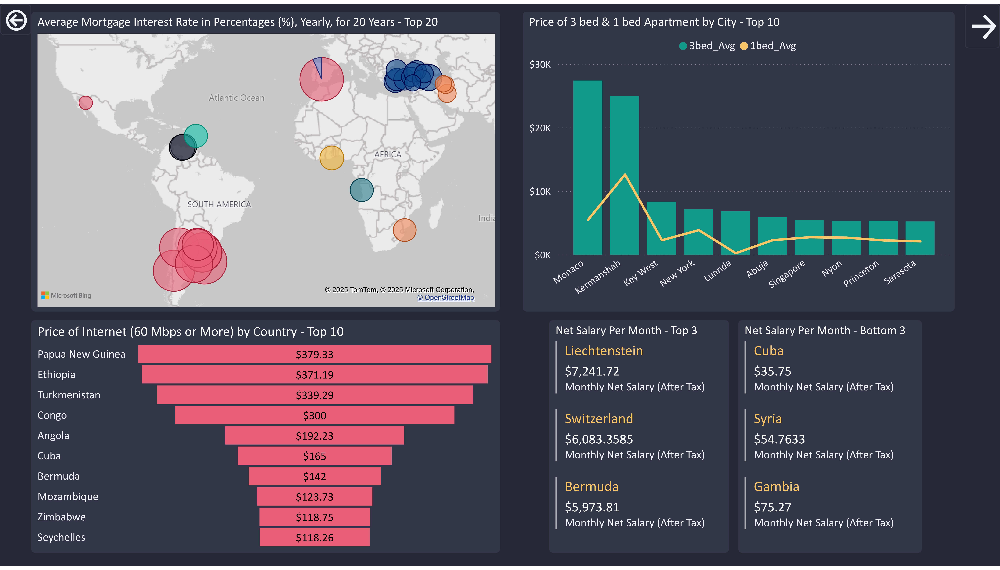

# 📊 Power BI Dashboard Showcase — Global Price Analysis

This repository showcases an interactive Power BI project analyzing global cost-of-living metrics including food, drinks, restaurant, and fuel data.  

---

## 🏠 Main Dashboard
**Overview of navigation menu.**

---

## 🍎 Food Dashboard
**Comparison of food item prices (apples, rice, eggs, chicken) across top countries and cities.**

---

## 🍹 Drink Dashboard
**Insights on beverage prices such as bottled water, milk, imported vs. domestic beer.**

---

## 🍽️ Restaurant & ⛽ Gas Dashboard
**Shows average cappuccino, Coke/Pepsi, meal & mcneal costs, gasoline prices by country, and related economic indicators.**

---

## 💼 Others Dashboard
**Includes metrics on mortgage, housing, internet costs, and salary insights offering a complete cost-of-living perspective.**

